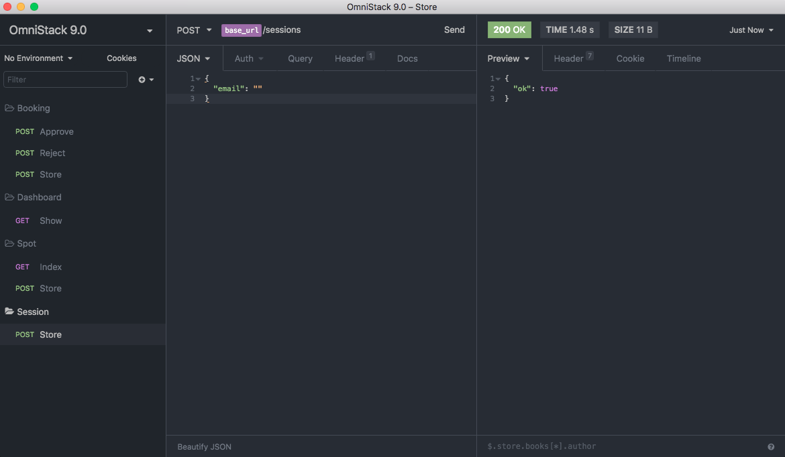

# Aircnc back end

## What is aircnc?

Aircnc is an app where we can rent and book corporate spots.

___

## Front-end and Mobile

We have the web version and also the mobile, I will leave you the link below for easy access.

* [Front-end](https://github.com/lineuxyz/aircnc-frontend)

* [Mobile](https://github.com/lineuxyz/aircnc-mobile)

___

## Before you start

Below I will leave all the tools that were used in building this API and how to get it started:

* [yarn](https://yarnpkg.com/en/docs/install#mac-stable)
* [insomnia](https://insomnia.rest/download/#mac)
* [mongoDB](https://www.mongodb.com/download-center/compass)

I'm making my JSON file available for insomnia and below is an image of my structures and how it went.

You also need to put in the ``server.js`` file your configuration with ``mongoDB``. I left the area blank with just the quotation marks, just insert inside the quotation marks on ``line 15`` in ``mongoose.connect``

After cloning you need to run a ``yarn`` in the root of the project to install the dependencies, just run a ``yarn dev`` and the backend will start.

___

## Uploads folder

When an image upload is done (service available in the web version) the image will go straight to the uploads folder, if you feel the need to change the path the files will be saved just change in the ``uploads.js`` file in the ``config`` folder.

___ 

The whole project was developed thanks to the knowledge gained from rocketseat week omnistack 9.0

