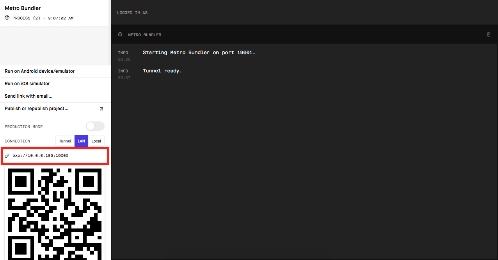

# Aircnc mobile

## What is aircnc?


Aircnc is an app where we can rent and book corporate spots.

In this part of the project you can reserve a spot available according to the technologies you are looking for, select the date you want and you're done! If approved or rejected it will appear in time for you, in real time.

___

## Front-end and Back-end

We have the back-end and also the front-end I will leave you the link below for easy access.

* [Front-end](https://github.com/lineuxyz/aircnc-frontend)

* [Back-end](https://github.com/lineuxyz/aircnc-backend)

___

## Before you start

This application was developed using Expo, so you can run it from both your own smartphone and emulator. It has been tested on Android and iOS environment.

To start the project you need to install global expo cli, you need to have npm (if you already use node then you will already have npm installed). Now you need to run ```$ npm install -g expo-cli``` then just run ```expo start```. Opening the browser object with the expo log you need to copy the IP address below and paste it into the ```services``` folder in ```api.js``` file inside baseURL. Now all ok you can scan the QR code or follow the other methods of opening the project.



---

The whole project was developed thanks to the knowledge gained from rocketseat week omnistack 9.0


